# SMRPO \- Orodje za podporo Scrumu

**Authors:** Marko Adžaga, Nino Brezac, Bojan Ilić, Miha Krajnc

The app is a Scrum, Kanban board mix, built using:
- **M**ongoDB
- **E**xpress
- **AN**gular

Set up instructions are in [SETUP.md](./setup.md) \
User documentation is given below, in the form of story descriptions and screenshots (in Slovene):

## \#0 \- Prijava v sistem

Za prijavo v sistem se najprej prestavimo na **prijavno stran** s klikom na gumb **"Login"** v orodni vrstici.

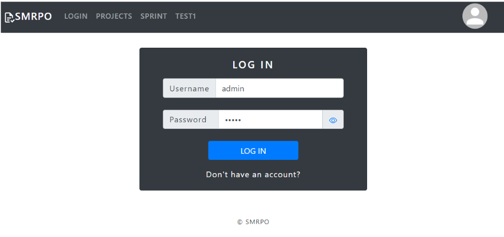  
Uporabnik se prijavi s pravilnim uporabniškim imenom in geslom, ter pritiskom na gumb, ob katerem ga aplikacija prestavi na začetno stran. Če uporabnik vpiše napačno uporabniško ime ali geslo, ga aplikacija o tem obvesti.  
   
Aplikacija ima možnost razkritja gesla zaradi lažjega vnosa, prepreči pa kopiranje vsebine iz polja za geslo. Geslo mora biti dolgo 12 znakov, ne sme pa biti daljše od 128\. Ne sme biti eno od 100 najbolj pogostih. Gesla ne krajšajo presledkov in v podatkovni bazi so shranjena z zgoščevalno funkcijo.

Aplikacija vsebuje tudi password-meter, ki uporabniku prikaže kako varno je njegovo geslo.   
Po prijavi je uporabniku v stranski vrstici viden podatek o rednem številu trenutne prijave ter času zadnje prijave.

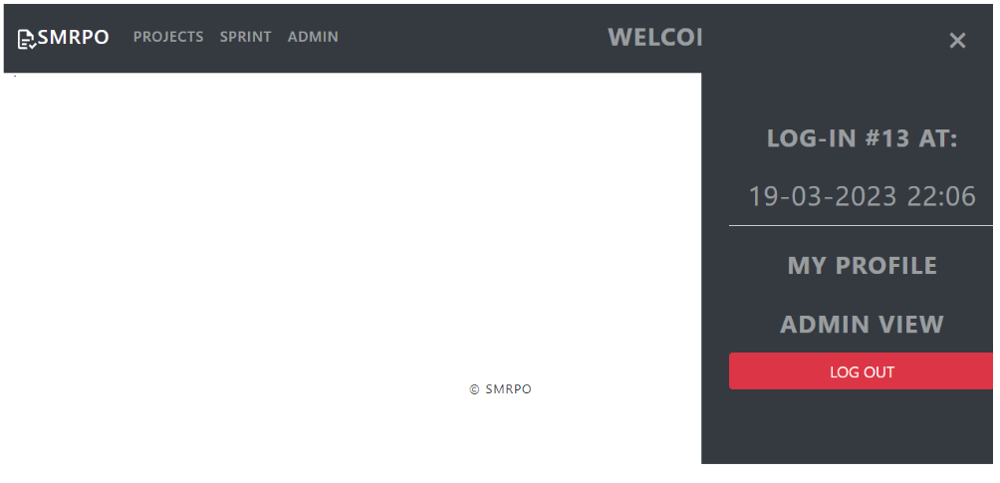  

Klikom na gumb “My profile” v stranski vrstici uporabnik pride do svog profila, kjer na podoben način lahko spremeni svoje geslo.

## \#1 \- Dodajanje uporabnikov

Za začetek se prestavimo na prijavno stran s klikom na gumb login v orodni vrstici.  
V aplikacijo se vpišemo z uporabniškim imenom in geslom s pritiskom na gumb “Log in”. 

  

Ob uspešni prijavi prikaže se nam domača stran aplikacije. Nato se prestavimo na administratorski pregled s klikom na gumb admin v orodni vrstici. Na administratorskem pregledu ima administrator tabelaričen vpogled v vse vpisane uporabnike v sistemu.  
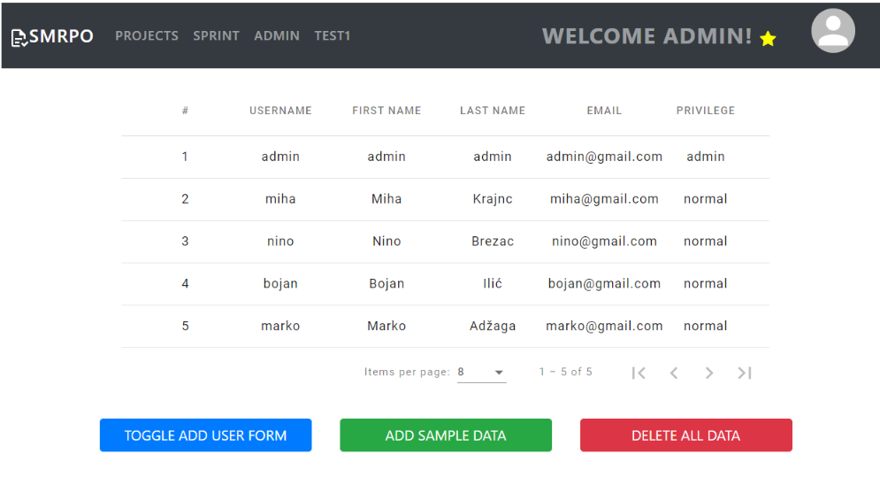
Pritiskom na gumb za dodajanje novega uporabnika (toggle add user form) se prikaže vnosni obrazec, kjer novemu uporabniku določi ime, priimek, uporabniško ime, geslo, e-pošto ter sistemske pravice.  
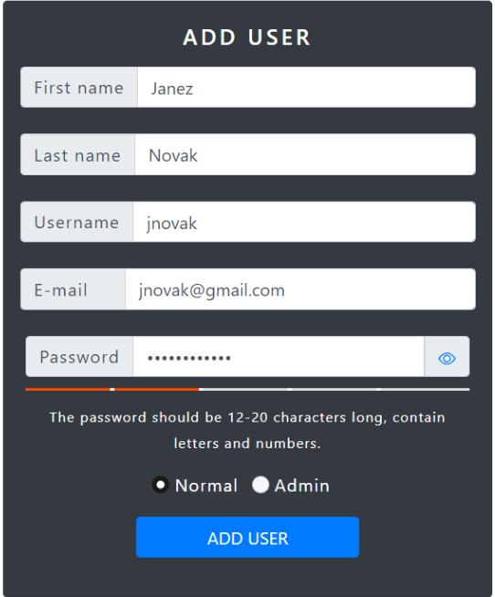 
Če so podatki vneseni ustrezno, se ob kliku na gumb “add user” administratorju prikaže sporočilo o uspešnem dodajanju (“user successfully added”).

## \#2 \- Vzdrževanje uporabnikov

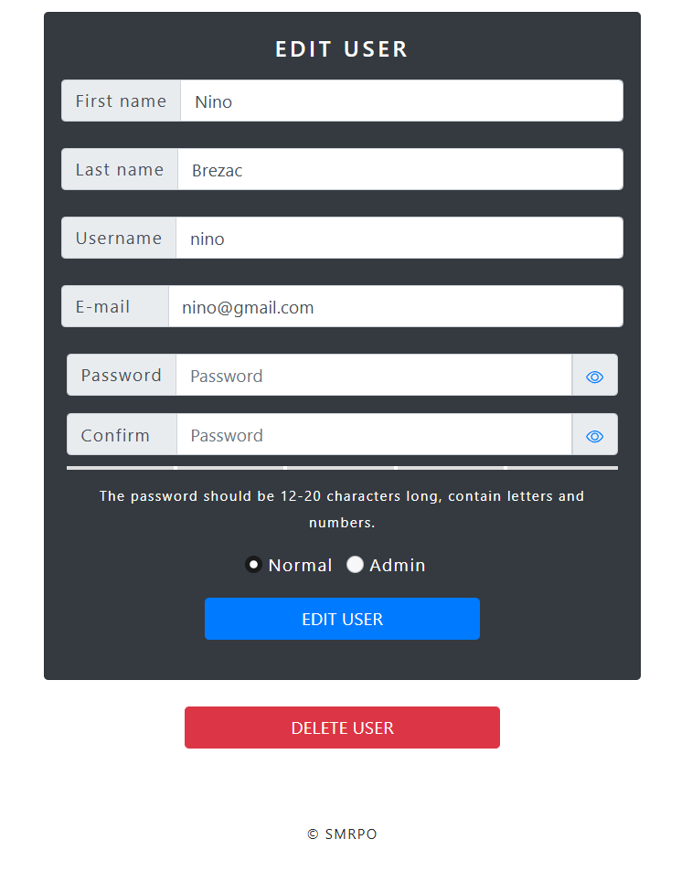 
Podobno kot pri #1, prijavimo se kot administrator.
Vidimo tabelaričen izpis uporabnikov. Kliknemo ikonico edit/delete od uporabnika, ki mu želimo spremeniti podatke. 

Prikaže se vnosni obrazec, kjer uporabniku spremenimo ime, priimek, uporabniško ime, geslo, e-pošto ter sistemske pravice. 

Če so podatki vneseni ustrezno, se ob kliku na gumb edit user” administratorju prikaže sporočilo o uspešni spremembi (“user successfully modified).

## \#3 \- Spreminjanje lastnih uporabniških podatkov

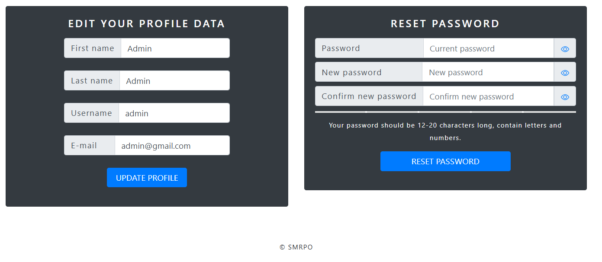 

Klikom na ikonico v zgornjem desnem kotu se razpre meni. Izberimo opcijo "my profile".

Prikažeta se dva vnosna obrazca. V prvem lahko spremenimo ime, priimek, uporabniško ime, e-pošto ter sistemske pravice v drugem pa geslo. Geslo seveda mora ustrezati opisanim zahtevam (12-20 znakov, črke in številke).

Ob klikom na gumb spodaj obrazca se prikaže sporočilo o uspešni spremembi (“user successfully modified).

## \#4 \- Dodajanje projekta

Za začetek se prestavimo na pregled projektov s klikom na gumb “projects” v orodni vrstici. Nato nadaljujemo na dodajanje projektov klikom na gumb “Add project”.

Na novi strani vpišemo ime projekta ter njegov opis. Potem nujno določimo še skrbnika metodologije projekta (scrum master) ter lastnika izdelka (product owner). Vnos končamo tako da dodamo še razvijalce na projektu (developers). S klikom na gumb “Add project” je projekt ustvarjen. 

V kolikor želimo ustvariti projekt z imenom, ki že obstaja nam aplikacija to onemogoči ter vrne sporočilo “Project with this name already exists\!”. Prav tako ni mogoče postaviti istega uporabnika hkrati kot skrbnika metodologije ter lastnika izdelka.

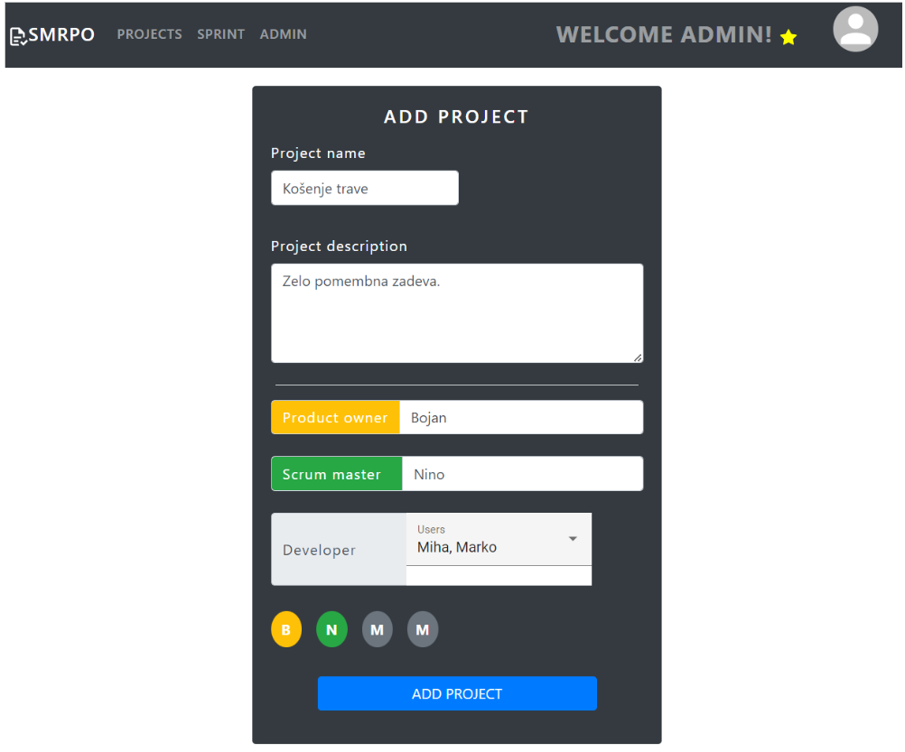

## \#5 \- Vzdrževanje projekta

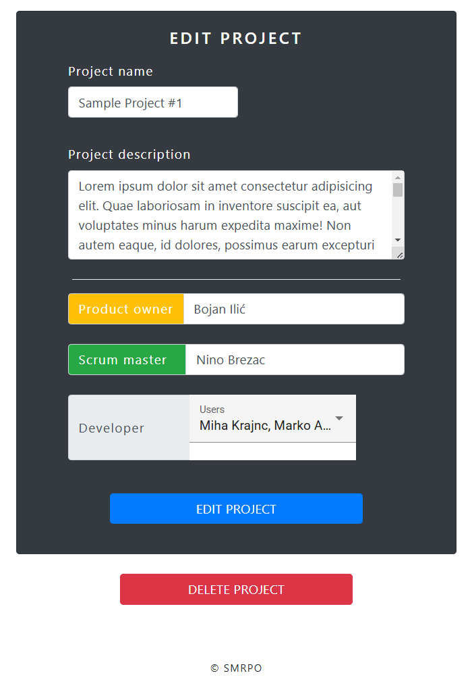 

Za začetek se prestavimo na pregled projektov s klikom na gumb “projects” v orodni vrstici. Nato nadaljujemo na urejanje projekta s klikom na ikonico v zgornjem desnem delu projekta.

Projektu lahko spremenimo ime, opis, product ownerja in scrum masterja. Lahko določimo tudi programerje. Spremembe shranimo s klikom na gumb spodaj, ki potem prikaže sporočilo o uspešni spremembi. Projekt lahko tudi pobrišemo klikom na rdeči gumb na koncu.

## \#6 \- Ustvarjanje novega sprinta

Za začetek se prestavimo na stran, kjer so prikazani vsi projekti na katerih je uporabnik vključen in si izberemo en projekt.

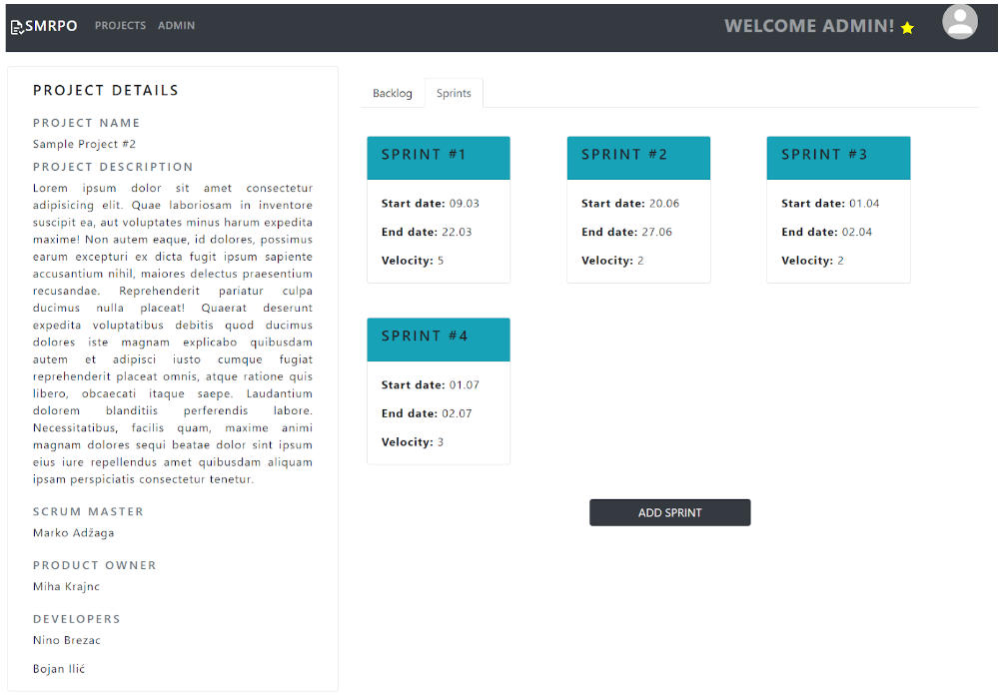

Pritisnemo gumb “Add sprint”. Odpre se obrazec za ustvarjanje novega sprinta in gumb se pretvori gumb za skrivanje obrazca. Ustrezno izpolnimo polja za začetek sprinta, konec sprinta in hitrost sprinta in pridobimo obvestilo o uspešno dodanem sprintu.  
Obvestilo o neuspešnem vnosu pridobimo, če:

* Je končni datum pred začetnim.  
* Začetni datum je v preteklosti.  
* Hitrost sprinta je podana z neregularno vrednostjo.  
* Sprint se prekriva z obstoječim sprintom.

## \#7 \- Vzdrževanje obstoječih sprintov

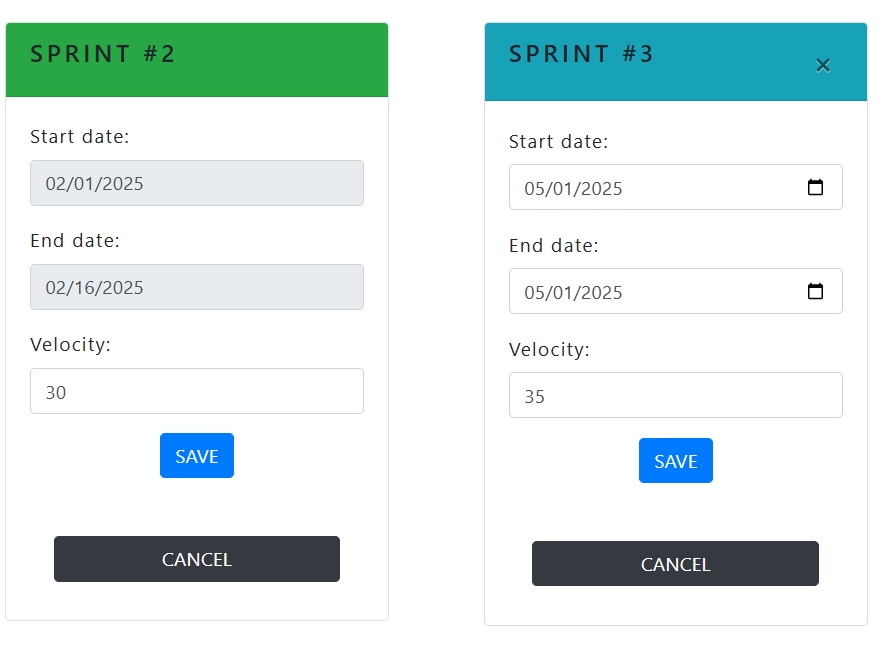 

Za začetek se prestavimo na stran, kjer so prikazani vsi projekti na katerih je uporabnik vključen in si izberemo en projekt.

Pritisnemo gumb “Sprints” in kliknemo gumb **Edit sprint**. Odpre se obrazec za urejanje sprinta in prikažeta se gumba save in cancel, ki shranijo oz. povozijo spremembe. Aktivnem sprintu lahko samo spremenimo hitrost, bodočem sprintu pa lahko tudi datum.

## \#8 \- Dodajanje uporabniške zgodbe

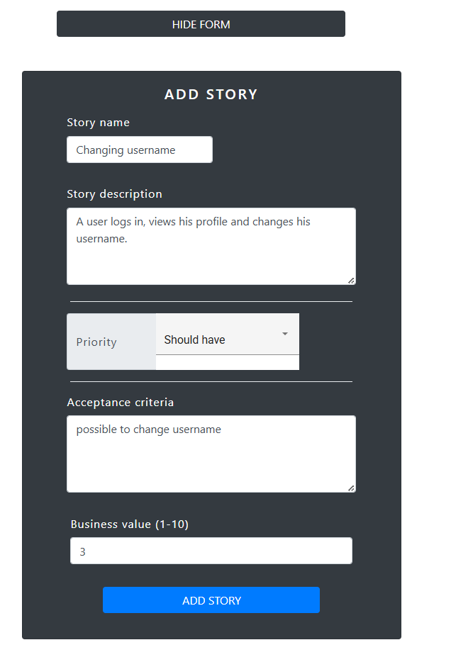 

Če želimo dodati uporabniško zgodbo, moramo najprej navigirati do strani s projekti, ter izbrati enega. Na strani s podrobnostmi o projektu moramo izbrati zavihek **Backlog**, kjer vidimo vse uporabniške zgodbe, ki še niso bile dodeljene nobenemu sprintu.

Pritisnemo gumb **Add story**. Odpre se obrazec za dodajanje novih uporabniških zgodb. Ustrezno izpolnimo vsa vnosna polja ter pritisnemo gumb **Add story.** Če smo ustrezno nastavili vsa vnosna polja, se bo naša zgodba ustrazno vnesla v podatkovno bazo ter prikazala zgoraj. V nasprotnem primeru bo uporabniku prikazana napaka, ki jo mora odpraviti.

## \#9 \- Urejanje uporabniške zgodbe

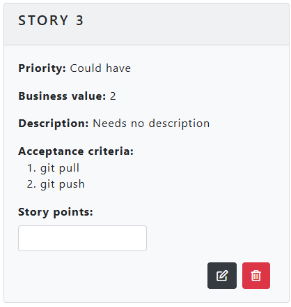 
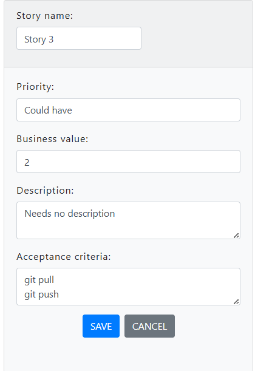 

Produktni vodja in skrbnik metodologije lahko urejata in brišeta uporabniške zgodbe, ki še niso dodeljene Sprint-u in hkrati še niso realizirane. S klikom na uporabniško zgodbo se odpre vnosni obrazec, kjer lahko ureja ime, opis, prioriteto, poslovno vrednost, velikost uporabniške zgodbe ter jo doda v Sprint. S klikom na gumb Save se spremenjeni podatki kartice shranijo, s klikom na gumb »Cancel se spremembe povozijo. Klikom na ikonico smeti se zgodba pobriše.

## \#10 \- Dodajanje komentarjev

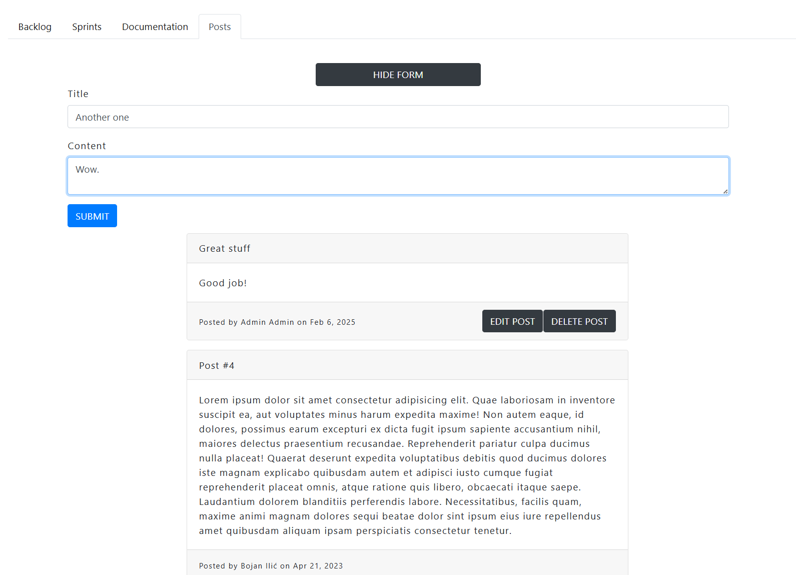 

S klikom na zavihek posts znotraj uporabniške zgodbe lahko vidimo pregled vseh komentarjev. Klikom na gumb add post se odpre obrazec za vnos komentarjev. Komentarju se vnese naslov in vsebina in potem se odda.

## \#11 \- Ocena časovne zahtevnosti

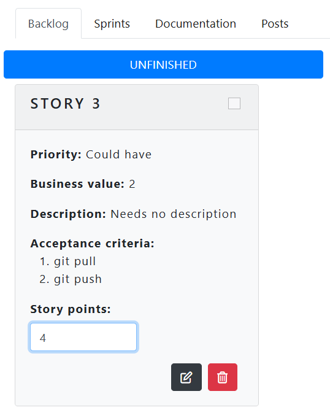 

Uporabniški zgodbi, ki še ni dodeljena v Sprint, lahko skrbnik metodologije dodaja časovno zahtevnost pri kreiranju nove uporabniške zgodbe ter jo spreminja ob urejanju zgodbe. V vnosno polje »Size [in points]« lahko uporabnik vnese le številsko vrednost večjo ali enako ena. Ob kliku na gumb Save se novi podatki shranijo.

V kolikor uporabnik nima pooblastil za spreminjanje časovne zahtevnosti oziroma je uporabniška zgodba že dodeljena Sprint-u , je gumb za shranjevanje sprememb onemogočen, uporabniku pa se izpiše sporočilo z možnimi razlogi za onemogočeno spreminjanje časovne zahtevnosti uporabniške zgodbe.

## \#12 \- Dodajanje zgodb v sprint

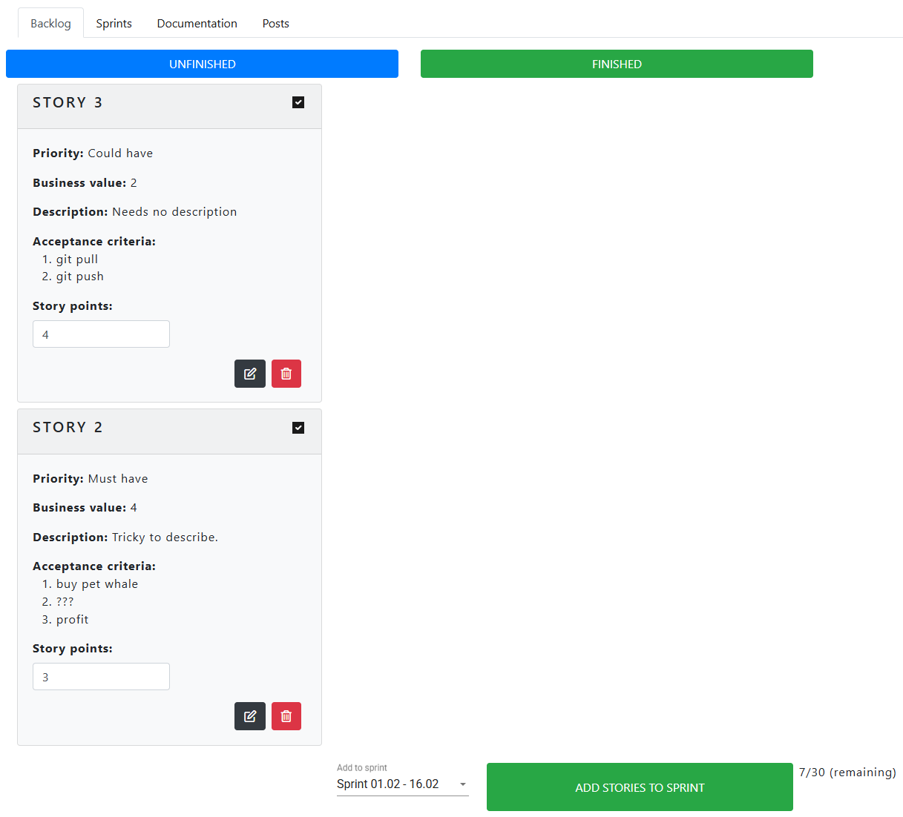 

Skrbnik metodologije lahko uporabniške zgodbe, ki imajo ocenjeno časovno zahtevnost dodaja v aktivni Sprint. To lahko stori tako, da obkljuka polje v zgornjem desnem kotu zgodbe in nato izbere sprint katerem bi zgodbo dodal. Zgodbo nato doda klikom na Add stories to sprint. Zgodbe ne smejo že biti dodeljene in ne smejo presegati hitrosti sprinta.

Po izbiri in kliku na gumb »Add« so izbrane uporabniške zgodbe dodane v aktivni Sprint, kar je uporabniku sporočeno s povratno informacijo.

## \#13 \- Dodajanje nalog v zgodbo

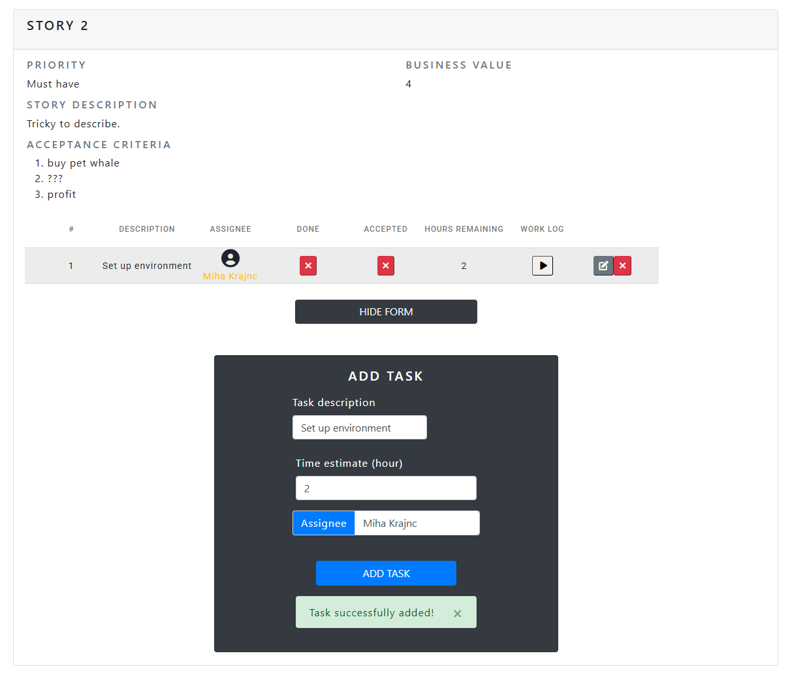 

Izberemo aktiven sprint označen z zeleno barvo. Na strani sprinta so prikazane njegove informacije, pripadajoče zgodbe in njihove informacije. Znotraj zgodbe kliknemo na gumb Add task. Nato se odpre vnosni obrazec, kjer vpišemo opis naloge in oceno ur, ter določimo izvajalca.

## \#14 \- Vzdrževanje obstoječih nalog

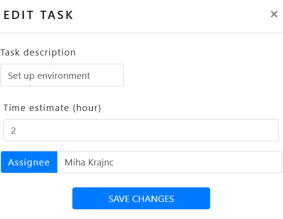 

Skrbnik metodologije in člani razvojne skupine lahko urejajo ime naloge, število potrebnih ur za izvedbo, dodeljujejo naloge ter jih brišejo znotraj pregleda zgodbe v pregledu sprinta. Ob kliku na gumb za urejanje se prikaže modalno okno, ki omogoča spreminjanje opisa naloge, ocene ur in izvajalca.

## \#15 \- Sprejemanje nalog

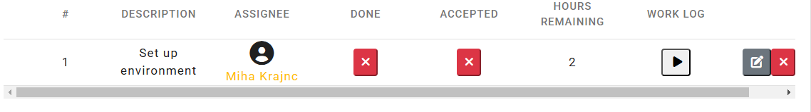 
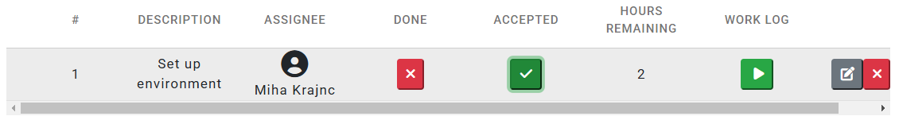 

Ko se članu ekipe dodeli naloga v uporabniški zgodbi, jo prvič mora sprejeti. S pritiskom na križec v stolpcu »ACCEPTED« sprejme nalogo in prevzame odgovornost za njeno izvedbo. Naloga je nato dodeljena in lahko se beleži čas, označi kot zaključena. Nalogo lahko tudi samoiniciativno sprejme tako da klikne uporabniško ikonico na nalogi.

## \#16 \- Odpovedanje nalogam

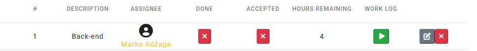 
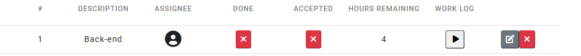 

V kolikor je bila uporabniku dodeljena naloga znotraj uporabniške zgodbe, ima le-ta možnost, da jo sprejme ali zavrne. V primeru, da želi zgodbo zavrniti to naredi s pritiskom na svojo uporabniško ikonico. S tem je naloga zavrnjena in je brez lastnika.

## \#17 \- Beleženje porabe časa

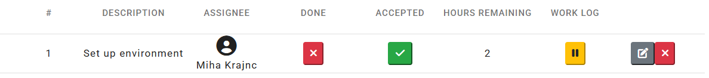 
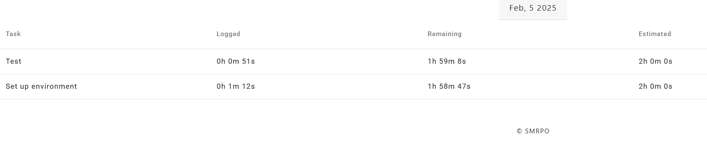 

Ko je razvijalec sprejel nalogo lahko začne beležiti porabo časa. S klikom na časovnik, sproži se štetje časa. Štetje časa se sproži samo, če naloga ni že končana. Ko zaključi z delom, klikne na gumb pavze in s tem se števec ustavi. Zabeležene ure za delo na kartici so nato pojavijo v časovni tabeli ločene po dnevih. Tabela je dostopna v orodni vrstici.

## \#18 \- Zaključevanje nalog

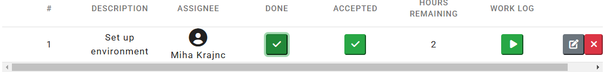 

Ko uporabnik nalogo zaključi, jo lahko označi kot končano. To stori s klikom na križec v stolpcu DONE za želeno nalogo.

## \#19 \- Zaključevanje zgodb

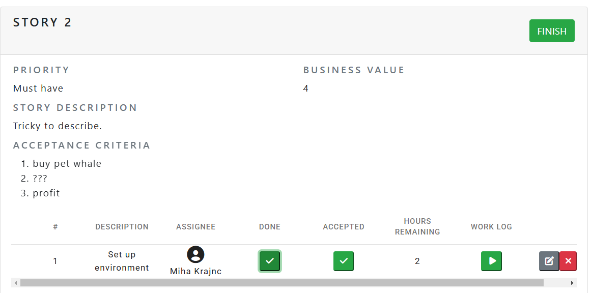 

Ko ima zgodba vse naloge zaključene, jo lahko razvijalec kot končano. To stori s klikom na gumb finish v zgornjem desnem delu zgodbe znotraj pregleda sprinta. Nato se čaka še potrditev od strani produktneg vodje.

## \#20 \- Potrjevanje zgodb

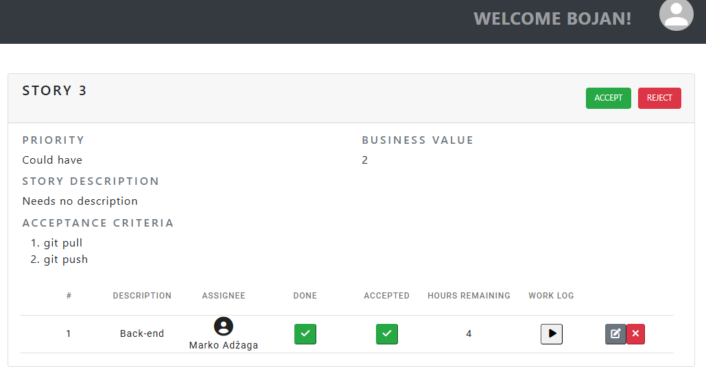

Po končani nalogi lahko produktni vodja preveri, katere izmer uporabniških zgodb so končane. Odpre pregled sprinta in se potem odloči, ali je zgodba primerna za potrditev. V kolikor se odloči da je uporabniška zgodba primerna za potrditev, lahko to stori z gumbom »ACCEPT«.

## \#21 \- Zavračanje zgodb

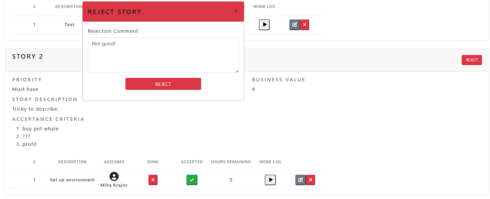

Po končani nalogi lahko produktni vodja preveri, katere izmer uporabniških zgodb so končane. Odpre pregled sprinta in se potem odloči, ali je zgodba primerna za potrditev. V kolikor se odloči da je uporabniška zgodba primerna za potrditev, lahko to stori z gumbom »REJECT«. Produktni vodja mora zavrnitev zgodbe obrazložiti s komentarjem, ki ga poda v modalnem oknu, zgodba pa je vrnjena v backlog.

## \#22 \- Vzdrževanje dokumentacije

Sodelujoči na projektu lahko urejajo uporabniško dokumentacijo za projekt, ki je dostopna preko gumba »Documentation« znotraj projekta. Klikom na gumb choose file se izbere dokumentacija, ki se nato lahko naloži s klikom na gumb Upload. Ob uspešnem nalaganju se prikaže sporočilo, dokumentacija pa prikaže v seznamu datotek spodaj. Dokumentacija se nato lahko naloži lokalno, uredi, ali pobriše s klikom na ustrezne ikonice zraven.

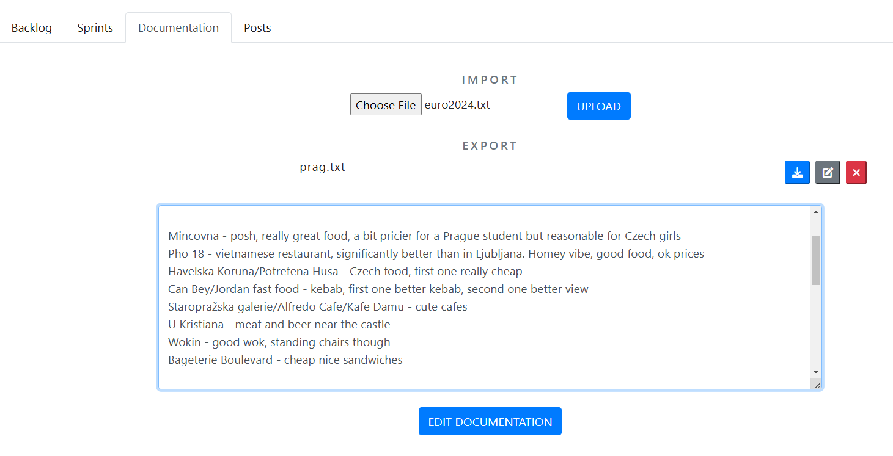

## \#23 \- Seznam uporabniških zgodb

Ko uporabnik odpre obstoječi projekt si lahko v zavihku »Backlog« ogleda vse uporabniške zgodbe projekta, ki se delijo v tri kategorije. V kategorijo Unfinished sodijo uporabniške zgodbe, ki ativnem Sprintu ali pa še ne pripadajo nobenemu sprintu (uporabniške zgodbe se ločijo z značkami). V drugi kategoriji Finished se nahajajo vse zaključene uporabniške zgodbe. V tretji kategoriji Future release pa se nahajajo vse uporabniške zgodbe, ki niso predvidene v trenutni izdaji in imajo za prioriteto označeno Won’t have this time. Vse uporabniške zgodbe so glede na kategorijo ločne v stolpce ter obarvane z različnimi barvami. Stolpci se lahko razprejo in skrijejo s klikom.

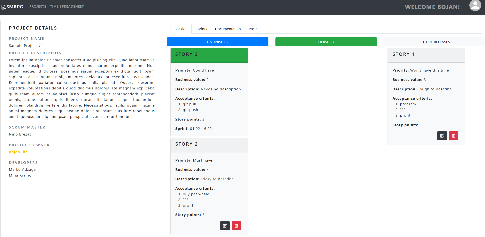

## \#24 \- Seznam nalog

Aktivni Sprint ima možnost pregleda vseh nalog, ki so oziroma so bile predvidene v Sprint-u. S klikom na sprint se uporabniku odpre stran sprinta.
Seznam nalog je razdeljen glede na uporabniške zgodbe, znotraj katere so zapisane vse naloge, ki jih ta vsebuje. Vsaka naloga ima značko, ki označuje ali je ta dodeljena ali nedodeljena. Dodeljene naloge pa imajo lahko tudi značko zaključena ali aktivna (ko na nalogi poteka delo v tem trenutku - uporabnik beleži ure za to nalogo).

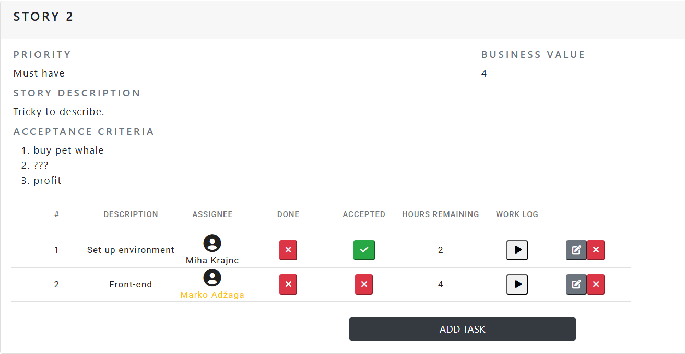